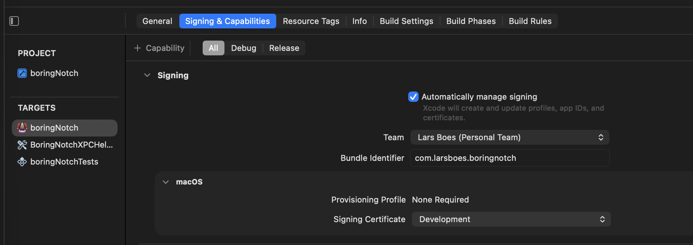

<p align="center">
  
</p>
<h1 align="center">machNotch</h1>
<p align="center">
  <strong>A native macOS notch utility with a modern plugin architecture, clean dependency injection, and a growing suite of built-in productivity surfaces.</strong>
</p>

<p align="center">
  <a href="https://github.com/larsboes/mach-mono/actions/workflows/cicd.yml">
    
  </a>
  <a href="https://github.com/larsboes/mach-mono/releases">
    
  </a>
  <a href="https://github.com/larsboes/mach-mono/releases/latest">
    
  </a>
</p>

<p align="center">
  <video src="https://github.com/user-attachments/assets/b8912856-6c8c-48bd-9d0c-16ab084ddd59" width="700" autoplay loop muted></video>
</p>

---

## What is machNotch?

machNotch transforms your MacBook's notch into a dynamic control center with music playback, calendar, file shelf, HUD replacements, and more.

The app focuses on:

### Architecture Overhaul
- **Plugin-first architecture** — every feature is a `NotchPlugin`. Built-in features use the same API that future third-party plugins will use.
- **Protocol-based dependency injection** — zero `.shared` singletons in views/services. Everything injected via `@Environment` or init.
- **`@Observable` + `@MainActor`** throughout — no legacy `ObservableObject`/`@Published`.
- **Clean layer boundaries** — Domain, Application, Infrastructure, Presentation layers with enforced import constraints.
- **Service protocols** for all system integrations (music, battery, calendar, weather, shelf, webcam, notifications, clipboard).

### Integrated Community PRs
Cherry-picked and adapted the best community contributions that were pending on upstream:

| Feature | Original PR |
|---------|-------------|
| Sneak peek duration customization | #897 |
| Auto-disable HUD on disconnected displays | #895 |
| Screen recording live activity | #804 |
| Mood face customization | #798 |
| Clipboard history + note-taking (SQLite-backed) | #788 |
| Animated face with mouse tracking | #751 |

### New Plugins
- **Teleprompter Pro** — full-featured teleprompter with countdown timer, mic monitoring, hover-to-pause, keyboard shortcuts, AI text assist (refine/summarize/draft via Ollama), speed/font/color controls
- **Habit Tracker** — daily habit tracking with streaks, progress rings, and persistent storage
- **Pomodoro Timer** — focus timer with work/break intervals, session history, and notch-integrated controls
- **Display Surface** — generic display arbitration for surfacing prioritized content

### AI & Integrations
- **AI subsystem** — `AIManager` + `AIProvider` protocol with Ollama backend for on-device text generation
- **Local API server** — HTTP + WebSocket server for external integrations. Auth middleware, rate limiting, plugin API routes
- **`notchctl` CLI** — command-line control of machNotch via the Local API
- **App Intents & URL Scheme** — Siri Shortcuts integration + `machnotch://` deep links

### Performance
- **Background service backoff** — plugins and services automatically pause polling when the notch is closed (zero idle CPU)
- **Phase 2 efficiency** — isolated high-frequency progress updates into leaf reader views, event-driven geometry, XPC helper backoff
- **TimelineView gating** — music controls switch to static layout when closed (no 60fps background burn)
- **GPU/CoreAnimation backoff** — heavy blur/blend effects gated behind transition state

### Additional Improvements
- **Apple-quality animations** — content reveal modifier, shadow easing, spring-tuned open/close choreography
- **Dual hover zones** — separate closed/open hover detection for accurate mouse tracking
- **Heartbeat-based hover** — replaced event-driven hover with a robust heartbeat controller (11 unit tests)
- **Data export** — `ExportablePlugin` protocol with export UI in Settings
- **SOLID & DDD hardening** — SRP extractions, type-safe `PluginID` enum, domain purity enforcement
- **CI pipeline** — build, test, and architecture boundary checks on every push

---

## System Requirements

- macOS **14 Sonoma** or later
- Apple Silicon or Intel Mac

---

## Installation

1) Download the latest DMG [here](https://github.com/larsboes/mach-mono/releases/latest).
2) Open the DMG and drag machNotch into Applications.
3) Launch machNotch and grant the requested permissions.

---

## Building from Source

### Prerequisites

- **macOS 14 or later**
- **Xcode 16 or later**
- A free **Apple Developer account** (for code signing)

### Building the DMG (Recommended)

Running the app outside of Xcode is highly recommended for proper memory management and avoiding debugger-induced retain cycles. You can build the full DMG installer locally:

```bash
cd Apps/machNotch/Configuration/dmg
./create_dmg.sh
```
This script compiles the release binary, signs it, and packages it using `dmgbuild` into a ready-to-use `.dmg`.

### Running in Xcode

1. **Clone this repository:**
   ```bash
   git clone https://github.com/larsboes/mach-mono.git
   cd mach-mono
   ```

2. **Open the project:**
   ```bash
   open Apps/machNotch/machNotch.xcodeproj
   ```
   Xcode will automatically resolve Swift Package dependencies on first open. If it doesn't, go to **File → Packages → Resolve Package Versions**.

3. **Fix code signing** (required — the project ships with the maintainer's team/bundle ID):
   - Select the **machNotch** project in the sidebar
   - For **each target** (`machNotch`, `MachNotchXPCHelper`, `machNotchTests`):
     1. Go to the **Signing & Capabilities** tab
     2. Check **Automatically manage signing**
     3. Change **Team** to your personal team
     4. Change **Bundle Identifier** to something unique (e.g., `com.yourname.machnotch`)

   

4. **Build and run:** Press `Cmd + R`.

   From the repository root you can also build and test with:
   ```bash
   xcodebuild -project Apps/machNotch/machNotch.xcodeproj -scheme machNotch -destination 'platform=macOS' build
   xcodebuild -project Apps/machNotch/machNotch.xcodeproj -scheme machNotch -destination 'platform=macOS' test
   ```

> **Note:** If Xcode shows "Missing package product" errors, close and reopen the project. The package cache can be slow to sync on first open.

---

## Browser Extension Setup (For YouTube/Web Media)

To get perfect, sub-second scrubber and duration sync for browser media like YouTube, install the bundled companion extension:

1. Open **Google Chrome** (or Chromium-based browser).
2. Navigate to `chrome://extensions/`.
3. Toggle on **Developer Mode** in the top-right corner.
4. Click **Load Unpacked** in the top-left corner.
5. Select the `machNotch-extension` folder located inside the repository directory.

The extension connects directly to machNotch via a local WebSocket to transmit metadata and receive media commands without any additional config!

---

## Architecture

```
SwiftUI Views -> PluginManager -> NotchPlugin instances -> Service Protocols -> System APIs
```

Every feature is a plugin. Plugins communicate via `PluginEventBus`, never by importing each other. See [docs/ARCHITECTURE.md](docs/ARCHITECTURE.md) for the full reference and [docs/PLUGIN_DEVELOPMENT.md](docs/PLUGIN_DEVELOPMENT.md) for the plugin development guide.

---

## Tagging & Release Strategy

machNotch uses an automated CI/CD pipeline built on GitHub Actions. To trigger a new DMG build and GitHub Release automatically:

1. Draft your changes and commit them to the repository.
2. Push a new semantic version tag starting with `v` (e.g., `v1.2.0`).

```bash
git tag v1.2.0
git push origin v1.2.0
```

The CI pipeline will automatically compile the app, generate the DMG, and attach it to a new GitHub Release with the corresponding version number.

---

## Acknowledgments

All credit for the original boring.notch concept and implementation goes to [TheBoredTeam](https://github.com/TheBoredTeam). machNotch builds on that foundation while moving into the mach-mono suite.

- **[MediaRemoteAdapter](https://github.com/ungive/mediaremote-adapter)** — Now Playing source support for macOS 15.4+
- **[NotchDrop](https://github.com/Lakr233/NotchDrop)** — Foundation for the Shelf feature

For a full list of licenses and attributions, see [THIRD_PARTY_LICENSES](./THIRD_PARTY_LICENSES.md).
