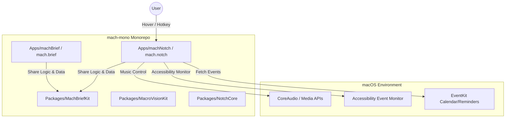
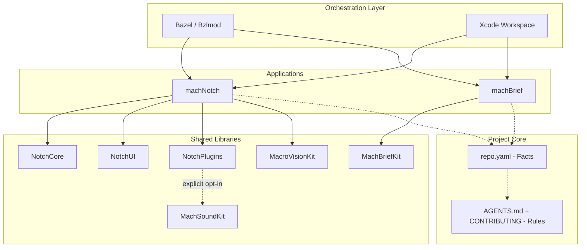
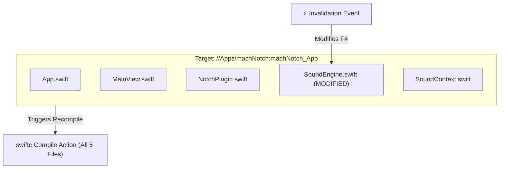
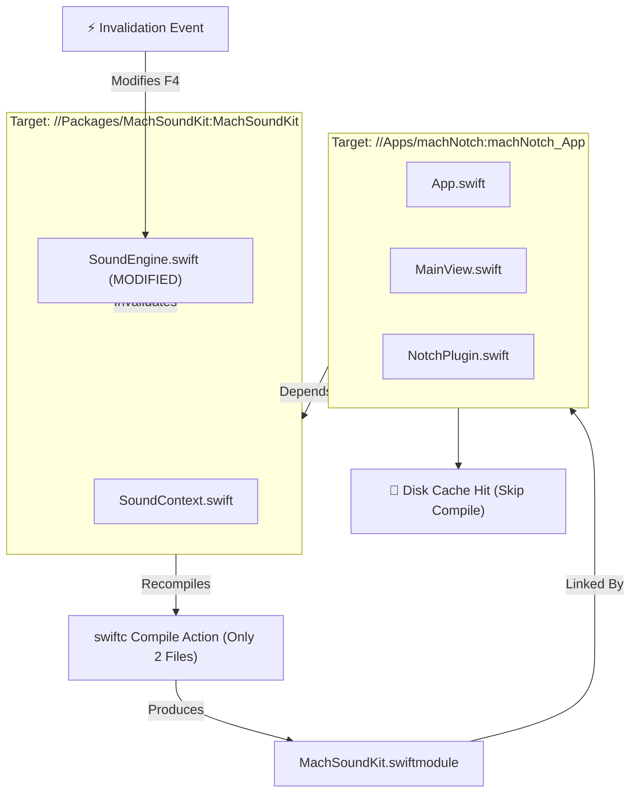

# machNotch System Architecture

This file is the single consolidated architecture reference for `machNotch` and the `mach-mono` repository.

---

## 1. System Overview

### High-Level System Context (C4 Level 1)

machNotch sits between the user, the macOS system, and local/external helper services.



### Container Diagram (C4 Level 2)

Inside the `mach-mono` repository, components are decoupled into small targets built and tested with Bazel.



---

## 2. Plugin Architecture

A plugin-first architecture where every feature — including built-ins — is a conforming plugin.

### Build Boundary Update (2026-06-13)

The plugin boundary is now represented in Bazel:

- `//Packages/NotchPlugins:NotchPluginCore` contains plugin protocols,
  `PluginManager`, `PluginContext`, settings wrappers, and plugin-facing UI
  environment helpers.
- Each built-in plugin has its own `swift_library` target
  (`NotchMusicPlugin`, `NotchBatteryPlugin`, `NotchShelfPlugin`, etc.).
- `//Packages/NotchPlugins:NotchPlugins` is the default facade used by machNotch.
  It re-exports default built-ins and contains app-facing view bridge helpers, but
  excludes Soundscape.
- `//Packages/NotchPlugins:NotchPluginsWithSoundscape` is the explicit opt-in
  target for builds that include `NotchSoundscapePlugin` and therefore
  `Packages/MachSoundKit` / AudioKit.

Validation commands:

```bash
bazelisk query 'deps(//Apps/machNotch:machNotch) intersect //Packages/MachSoundKit:MachSoundKit'
bazelisk query 'deps(//Packages/NotchPlugins:NotchPlugins) intersect //Packages/MachSoundKit:MachSoundKit'
```

Both default queries should return empty results.

Note: `Packages/NotchPlugins/Package.swift` is a SwiftPM shim and may lag this
Bazel target shape. Bazel is the canonical build graph for machNotch release and
CI builds.

Runtime note: plugin registration is descriptor-based and strict on-demand.
Built-ins and discovered external plugins can be listed, ordered, and shown in
settings/API surfaces from metadata without constructing plugin instances.
Factories run only when a plugin is enabled, displayed, configured, exported, or
otherwise explicitly requested.

### Layer Diagram

```
┌─────────────────────────────────────────────────────────────────────────────┐
│                              SwiftUI Views                                   │
│  ContentView, NotchHomeView, SettingsView                                   │
│  - No direct singleton access                                               │
│  - Receive PluginManager via @Environment                                   │
└─────────────────────────────────┬───────────────────────────────────────────┘
                                  │ renders
┌─────────────────────────────────▼───────────────────────────────────────────┐
│                            PluginManager                                     │
│  - Owns descriptor registrations and cached active plugins                  │
│  - Routes view requests to appropriate plugin                               │
│  - Manages plugin lifecycle (activate/deactivate)                           │
│  - Handles inter-plugin messaging                                           │
└─────────────────────────────────┬───────────────────────────────────────────┘
                                  │ manages
┌─────────────────────────────────▼───────────────────────────────────────────┐
│                         NotchPlugin Instances                                │
│  ┌───────────────┐  ┌───────────────┐  ┌───────────────┐  ┌──────────────┐ │
│  │  MusicPlugin  │  │ CalendarPlugin│  │  ShelfPlugin  │  │ WeatherPlugin│ │
│  │  :Playable    │  │  :Exportable  │  │  :Exportable  │  │              │ │
│  │  :Exportable  │  │               │  │  :DataStoring │  │              │ │
│  └───────┬───────┘  └───────┬───────┘  └───────┬───────┘  └──────┬───────┘ │
└──────────┼──────────────────┼──────────────────┼─────────────────┼──────────┘
           │ uses             │ uses             │ uses            │ uses
┌──────────▼──────────────────▼──────────────────▼─────────────────▼──────────┐
│                          Service Protocols                                   │
│  MusicService, CalendarService, ShelfService, WeatherService                │
│  - Wrap system APIs (MediaPlayer, EventKit, etc.)                           │
│  - Stateless or minimal state                                               │
│  - Injected into plugins via PluginContext                                  │
└─────────────────────────────────┬───────────────────────────────────────────┘
                                  │ accesses
┌─────────────────────────────────▼───────────────────────────────────────────┐
│                            Infrastructure                                    │
│  - System APIs (MediaPlayer, EventKit, CoreAudio, ScreenCaptureKit)         │
│  - Persistence (PluginSettings wrapping Defaults)                           │
│  - Networking (for Weather, future sync)                                    │
└─────────────────────────────────────────────────────────────────────────────┘
```

### Core Protocols

Every plugin must conform to `NotchPlugin`.

```swift
@MainActor
protocol NotchPlugin: Identifiable, Observable {
    var id: String { get }
    var metadata: PluginMetadata { get }
    var isEnabled: Bool { get set }
    var state: PluginState { get }

    func activate(context: PluginContext) async throws
    func deactivate() async

    @ViewBuilder func closedNotchContent() -> AnyView?
    @ViewBuilder func expandedPanelContent() -> AnyView?
    @ViewBuilder func settingsContent() -> AnyView?
}
```

---

## 3. Strict Modularization & Local Caching

We compile Swift targets using Bazel. To guarantee sub-second builds, we enforce **Strict Modularization** paired with a local action cache.

### Local Disk Cache

Action outputs are stored outside the project source tree to prevent pollution and speed up branch switching. To configure, add the following to `.bazelrc`:

```ini
build --disk_cache=~/.cache/bazel-disk-cache
```

- **Check Cache Size**: `du -sh ~/.cache/bazel-disk-cache`
- **Clear Disk Cache**: `rm -rf ~/.cache/bazel-disk-cache`

### Strict Modularization

Because any change inside a Bazel target invalidates the entire target's cache key, we keep app modules small.

The machNotch app target is split into:

- `machNotch_Lib`: all reusable app code except the `@main` launcher.
- `machNotch_App`: one-file `@main` launcher module that depends on
  `machNotch_Lib` and embeds `MediaRemoteAdapter`.

This avoids compiling the app source set twice in clean builds.

#### Scenario A: Monolithic Target (Recompiles All Files on Single Change)



#### Scenario B: Modularized Targets (Recompiles Only Changed Target)



---

## 4. machSound Engine Specification v1 (Frozen)

This section maps out the exact DSP behavior of the Fluid Symphony sound engine, ported from WebAudio to `AVAudioEngine`.

### Master Chain

| Item | Value |
|---|---|
| Grid | 16th notes; `stepDur = spb/4`, `spb = 60/bpm` |
| Master gain | `volume²` (volume slider 0–1, default 0.65) |
| Compressor | Master dynamics: threshold −14 dB, ratio 4:1 |
| Reverb | Convolution; stereo impulse: 3.0 s white noise shaped by `(1 − i/len)^2.6` |
| Delay | Dotted 8th = `0.75·spb`, feedback 0.32, wet 0.5 |
| Sidechain | EDM kick ducks pads + bass to gain 0.22, linear recovery to 1.0 over 0.30 s |

### Synthesis Voices

- **kick**: Sine wave, frequency `fHi` exp→`fLo` over `dur·0.5`, gain exp→0.001 over `dur`.
- **noiseHit**: White noise through dynamic bandpass or highpass filter.
- **bass**: Sawtooth wave, lowpass filter 650 Hz exp→220 Hz over duration.
- **pad**: Detuned sawtooth waves (±7 cents), lowpass filter controlled by energy.
- **rhodes**: Mixed sine wave harmonics (`f` + `2f` at 0.28 gain), detuned ±4 cents.

### Performance Modes

- **EDM**: 126 BPM, C minor chords (`Cm`, `A♭`, `B♭`, `G`), 4-beat sidechain ducking.
- **Ambient**: 72 BPM, A minor scale, slow 2.0 s attack pads, sub swell, shimmer.
- **Lo-fi**: 78 BPM, C major 7th chords, swung steps (`s%4=2` delayed by `+0.14·spb`), vinyl pops.

---

## 5. Audio-to-Visual Splatting Contract

The visualizer responds to beat triggers and continuous amplitude (`audioLevel`) by drawing particles on a normalized coordinate space.

| Event | Coord (X, Y) | Target Splat Parameters |
|---|---|---|
| **kick** | `0.5`, `0.42` | Radial burst of 5 splats, vel 260, k 0.16, radius 0.0035 |
| **note** | `0.18 + (midi%12)/11 * 0.64`, `0.5 ± 0.15` | Single splat, vel 210, k 0.30, radius 0.0011 |
| **bass** | `0.3 + rand * 0.4`, `0.16` | Vertical impulse, vel 240, k 0.18, radius 0.0022 |

Color palettes match the active music mode (e.g. ambient uses soft blue/cyan/orange, EDM uses purple/pink/magenta).

---

## 6. Inspirations

- [DockDoor](https://github.com/ejbills/DockDoor)
- [Atoll](https://github.com/Ebullioscopic/Atoll)
