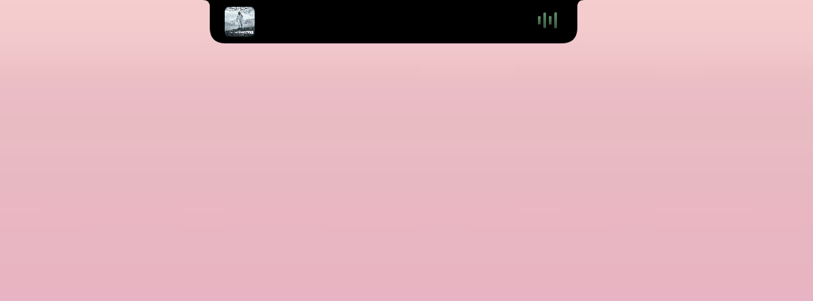
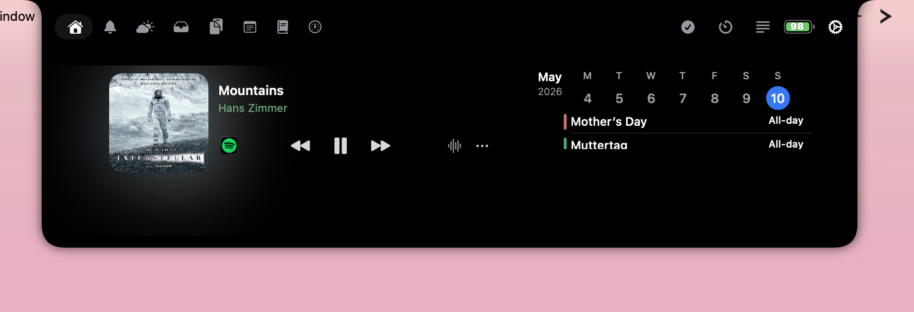
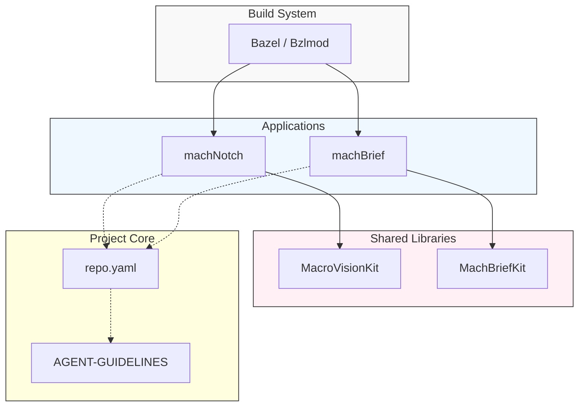

<h1 align="center">
  <br>
  <strong>mach-mono</strong>
  <br>
</h1>

<p align="center">
  A monorepo of focused macOS quality-of-life utilities — built on a hardened, plugin-first architecture.
</p>

<p align="center">
  <a href="https://github.com/larsboes/mach-mono/stargazers">
    
  </a>
  <a href="https://github.com/larsboes/mach-mono/actions/workflows/cicd.yml">
    
  </a>
  <a href="https://github.com/larsboes/mach-mono/blob/main/LICENSE">
    
  </a>
  
  
  
</p>

<p align="center">
  
  &nbsp;&nbsp;&nbsp;
  
</p>

---

## Design System

This monorepo adheres to a strict **Minimalistic Aesthetic**. 

> **Core Principles:** Clarity, Cohesion, Tech-Forward, Subtlety.

---

## What is Mach?

**Mach** is named after the [Mach microkernel](https://en.wikipedia.org/wiki/Mach_(kernel)) — the foundational layer that powers macOS itself. The name reflects the goal: a solid architectural foundation that macOS utilities can be built on top of, fast and reliably.

`mach-mono` is a monorepo housing a growing suite of native Apple-platform utilities. Each app is a focused SwiftUI product sharing common architectural conventions and — where it earns its keep — shared Swift packages.

**Build system:** **[Bazel](https://bazel.build/)** ([Bzlmod](https://bazel.build/external/module)) is the primary build system — all targets, tests, and CI run through Bazel. [`mach-mono.xcworkspace`](mach-mono.xcworkspace) is available for IDE navigation only.

> "We go Bazel or we go home!"

See [`docs/roadmaps/bazel.md`](docs/roadmaps/bazel.md) and [`docs/decisions/0007-native-bazel-builds.md`](docs/decisions/0007-native-bazel-builds.md).

## Critical Blockers (last update: 10.05.2026)

*   **Notch stability:** Intermittent random expansion (root cause unknown).
*   **Music UI:** Music display is functional but requires significant cleanup and timeline implementation.

*Tracking Issues: [issue tracker](https://github.com/larsboes/mach-mono/issues).*

## Background

This repo heavily relies on **Agentic Coding**. It grew organically out of curiosity for features and functionality, so code and architectural quality varies. Hardening reliability and improving code quality are the next big steps, but my priority remains on working features—after all, these are just quality-of-life additions.

For me, this is a playground to experiment with monorepo setups, Swift, and open-source practices. I took heavy inspiration from the existing Notch projects listed below, but my goal is to reengineer them significantly. :) 

If you plan to explore the codebase or contribute, you'll see the "clanker's" work. Please don't judge the agents—judge me for not guiding them properly. My long-term goal is to make this a truly "AI-ready" repository.


### Documentation model

Documentation and agent configuration are layered so facts do not drift across tools:

| Layer | Start here |
|-------|------------|
| **Structured facts** (workspace, schemes, products, policies) | [`repo.yaml`](repo.yaml) |
| **Agent guidelines** (architectural rules, conventions, workflows) | [`docs/AGENT-GUIDELINES.md`](docs/AGENT-GUIDELINES.md) |
| **Docs hub** (architecture, PRDs, ADRs, guides, tooling map) | [`docs/README.md`](docs/README.md) |
| **Per-app instructions** (DDD layout, plugins, code standards) | [`Apps/machNotch/CLAUDE.md`](Apps/machNotch/CLAUDE.md) |

Tool-specific entrypoints ([`CLAUDE.md`](CLAUDE.md), [`GEMINI.md`](GEMINI.md), [`AGENTS.md`](AGENTS.md)) only **point at** the canonical guidelines; they are not separate sources of truth. See *Where the overall model is defined* in [`docs/README.md`](docs/README.md) for the full map.

---

## Apps

### `mach.notch` — Notch Utility
> Transforms the MacBook notch into an interactive, plugin-driven command surface.

machNotch is focused on architectural quality: DDD layer boundaries, a SOLID plugin system, full dependency injection, and zero singletons in views or services. Every feature is a plugin — music, media controls, calendar, habits, pomodoro, shelf, teleprompter, battery, webcam, notifications, clipboard, weather, and more.

- **Location:** `Apps/machNotch/`

### `mach.brief` — Daily brief

Configurable daily content (words, facts, quotes, mantras, mood prompts) with optional sinks such as Obsidian. Shares [`Packages/MachBriefKit`](Packages/MachBriefKit). **In active development** — see [`docs/prds/machBrief-macOS.md`](docs/prds/machBrief-macOS.md).

- **Location:** `Apps/machBrief/`

---

## Repository Structure

```
mach-mono/
├── MODULE.bazel             # Bazel module root (Bzlmod)
├── WORKSPACE.bzlmod         # Workspace marker for Bazel
├── AGENTS.md                # Pointer to canonical AGENT-GUIDELINES.md
├── CLAUDE.md                # Thin Claude Code adapter
├── GEMINI.md                # Thin Gemini CLI adapter
├── repo.yaml                # Canonical structured repo facts
├── .agent/                  # Reusable agent workflows and skills
├── .claude/                 # Claude Code config
├── .cursor/                 # Cursor adapter rules
├── .github/                 # CI/CD workflows, issue templates
├── Apps/
│   ├── machNotch/           # mach.notch — notch utility (primary scheme)
│   └── machBrief/           # mach.brief — in development (see docs/prds)
├── docs/
│   ├── README.md            # Documentation index
│   ├── AGENT-GUIDELINES.md  # Canonical agent behavioral/arch rules
│   ├── architecture/        # System architecture references
│   ├── decisions/           # ADR-style decision records
│   ├── guides/              # Practical guides
│   ├── prds/                # Product requirement docs and implementation plans
│   └── roadmaps/            # Technical roadmaps (incl. Bazel rollout)
├── external/                # Vendored third-party trees consumed by Bazel
├── Packages/                # Shared Swift packages (MacroVisionKit, MachBriefKit, …)
├── resources/               # Demo assets, scripts
└── mach-mono.xcworkspace    # Xcode IDE navigation only (build via Bazel)
```

## Project Architecture

This diagram provides a high-level overview of the monorepo's technical structure:



---

## Getting Started

### Prerequisites

| Tool | Why | Install |
|------|-----|---------|
| **macOS 26+** | Required system version | — |
| **Xcode 26+** | Bundled SDKs and toolchain | Mac App Store |
| [**Bazelisk**](https://github.com/bazelbuild/bazelisk) | Wraps Bazel, auto-pins to `.bazelversion` (currently `7.6.1`) — no separate Bazel install | `brew install bazelisk` |
| [**Task**](https://taskfile.dev) | Thin wrapper over the canonical Bazel commands (`task run`, `task test`, …) | `brew install go-task` |
| **Apple ID** | Code signing — the free tier works (see [sideloading guide](docs/guides/sideloading.md)) | — |

### mach.notch

`task run` is the canonical launch command. It builds with Bazel, signs with your Apple Development cert, installs to `~/Applications/machNotch.app` (only when the build actually changed), and opens it. Installing to a stable signed path means macOS keeps the granted TCC permissions across every rebuild — no re-prompting on iteration.

```bash
git clone https://github.com/larsboes/mach-mono.git
cd mach-mono

task run         # build → sign → install (if changed) → launch
task kill        # terminate the running instance
task notch:test  # run machNotch tests only
```

### mach.brief

```bash
task brief:run    # build → install → launch
task brief:kill   # terminate the running instance
task brief:test   # run MachBriefKit tests only
```

### All tests

```bash
task test
# or directly:
bazelisk test //Apps/machNotch:machNotchTests //Packages/MachBriefKit:MachBriefKitTests
```

### IDE (Xcode — navigation only)

```bash
open mach-mono.xcworkspace
```

Xcode is for code navigation and editing only. Build and test via Bazel / Task.

<details>
<summary><strong>Detailed setup, signing, and troubleshooting</strong></summary>

#### Build only (no install / sign)

If you just want to verify a build compiles, skip `task run` and call Bazel directly:

```bash
bazelisk build //Apps/machNotch:machNotch
bazelisk build //Apps/machBrief:machBrief
```

#### Code-signing setup

`task run` signs the app bundle with `Apple Development: <you>`. List the identities in your keychain:

```bash
security find-identity -v -p codesigning
```

<p align="center">
  
</p>

If you have more than one, update `CERT` in [`Taskfile.yml`](Taskfile.yml) to match the one you want to use. **No paid Apple Developer account?** The free Apple ID flow works — see the [sideloading guide](docs/guides/sideloading.md).

#### First-run permissions

On first launch macOS will prompt for the permissions each plugin needs:

| Permission | Used by |
|------------|---------|
| Accessibility | Gestures, hover detection, media-key interception |
| Screen Recording | The notch overlay window itself |
| Microphone | Teleprompter monitoring |
| Calendar | Calendar plugin (read-only) |
| Notifications | Notification mirror plugin |

The install sentinel at `~/Library/Caches/com.larsboes.mach/notch_zip_hash` skips the install step when the binary hasn't changed, so prompts only fire when there is a *real* change to the bundle.

#### Troubleshooting

| Symptom | Fix |
|---------|-----|
| `codesign: no identity found` | Pick another cert from `security find-identity` and update `CERT` in `Taskfile.yml`, or follow the [sideloading guide](docs/guides/sideloading.md) for the free-tier flow. |
| Permissions reset after every rebuild | The binary changed, so the sentinel triggered a re-install. Expect *one* prompt cycle per real change. |
| Xcode shows red errors but Bazel builds fine | Trust Bazel — Xcode is for navigation only. |
| First build is very slow | Bazel is fetching `rules_apple` / `rules_swift` toolchains. Subsequent builds reuse the disk cache. |
| `error -600` when opening the app right after `task kill` | `task run` already inserts a `sleep 1` after kill; re-run if you hit it manually. |

#### What you don't need

No CocoaPods, no Carthage, no SPM at the repo root for development. All targets, tests, and CI run through Bazel + Bzlmod (see [ADR 0007](docs/decisions/0007-native-bazel-builds.md)). The root [`Package.swift`](Package.swift) exists only as input to `rules_swift_package_manager`.

</details>

---

## Roadmap

- [x] `mach.notch` — notch utility (shipped)
- [~] `mach.brief` — standalone daily brief app + [`MachBriefKit`](Packages/MachBriefKit) (in development)
- [~] `SystemStats` plugin — CPU/GPU/RAM/disk/network rings (in progress)
- [ ] `mach.window`, `mach.bar`, plus more notch plugins (PreventSleep, ExternalBrightness, ColorPicker, FocusMode, MenuBar) and shared `MachUI` package

The full, prioritised plan with phases and debt triage lives in [`docs/prds/machNotch.md`](docs/prds/machNotch.md). The doc index is at [`docs/README.md`](docs/README.md).

---

## Requirements

All system requirements, including minimum OS versions (macOS/iOS) and Swift language mode expectations, are centrally defined in [`repo.yaml`](repo.yaml).

---

## Acknowledgments

`mach-mono` builds on the shoulders of several exceptional open-source projects:

- [**boring.notch**](https://github.com/TheBoredTeam/boring.notch) — the foundational notch utility this fork originated from. The plugin architecture, media integration, shelf, and core notch interaction model all trace back here. An outstanding project by TheBoredTeam.

- [**Atoll**](https://github.com/Ebullioscopic/Atoll) — a feature-rich notch utility that expanded on boring.notch with live activities, lock screen widgets, system stats, and more. A major source of feature inspiration for what this suite aims to become.

- [**DockDoor**](https://github.com/ejbills/DockDoor) — window peeking, alt-tab, and dock enhancements for macOS. Inspiration for the upcoming `mach.window` app.

- [**MacroVisionKit**](https://github.com/TheBoredTeam/MacroVisionKit) — real-time fullscreen and window state detection framework powering the notch's context awareness.

- [**Stats**](https://github.com/exelban/stats) — reference implementation for macOS system metrics (CPU, GPU, memory, network, disk) via SMC and IOReport bindings.

- [**SkyLightWindow**](https://github.com/Lakr233/SkyLightWindow) — private API window rendering techniques.

- [**KeyboardShortcuts**](https://github.com/sindresorhus/KeyboardShortcuts), [**Defaults**](https://github.com/sindresorhus/defaults), [**Sparkle**](https://sparkle-project.org), [**Lottie**](https://github.com/airbnb/lottie-ios) — essential macOS development libraries used throughout.

---

## License

The repo currently mixes licenses — read carefully before forking or vendoring.

| Component | License | Target |
|---|---|---|
| `mach-mono` (root) + [`Apps/machNotch`](Apps/machNotch) | **GPL-3.0** (inherited from boring.notch) | MIT (after the cleansing migration completes) |
| [`Apps/machBrief`](Apps/machBrief) | MIT | — |
| [`Packages/MachBriefKit`](Packages/MachBriefKit) | MIT | — |
| [`Packages/MacroVisionKit`](Packages/MacroVisionKit) | MIT | — |

Full GPL-3.0 text: [LICENSE](LICENSE). Per-package licenses live next to each package.

### What GPL-3.0 means for you

- You may **use, modify, and redistribute** machNotch.
- Distributed binaries must come with **source** for any modifications, under GPL-3.0.
- Plugins compiled into the machNotch app fall under GPL-3.0 (linking).
- Contributions to machNotch will be GPL-3.0 until the migration described below completes.

### The MIT migration

`machNotch` inherited GPL-3.0 from [boring.notch](https://github.com/TheBoredTeam/boring.notch). The long-term plan is to relicense the root and machNotch as **MIT** once the boring.notch-derived code has been cleanly reimplemented. New apps and packages already start MIT; new clean-slate code in machNotch should be written without copying from upstream so it can be relicensed without further rework.

Decision record: [ADR 0003 — License policy](docs/decisions/0003-license-policy.md).
Migration plan: [machNotch PRD § License Migration](docs/prds/machNotch.md#license-migration--gpl-v3--mit).
Current and target license state per component is also tracked machine-readably in [`repo.yaml`](repo.yaml).
