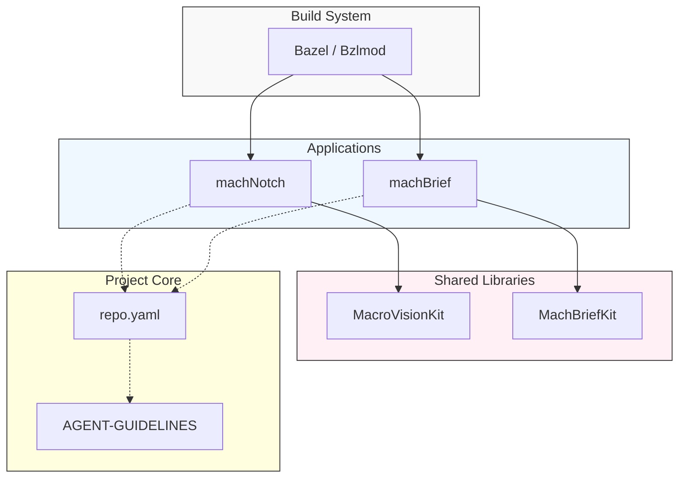

<h1 align="center">
  <br>
  <strong>mach-mono</strong>
  <br>
</h1>

<p align="center">
  A monorepo of focused macOS quality-of-life utilities — built on a hardened, plugin-first architecture.
</p>

<p align="center">
  <a href="https://github.com/larsboes/mach-mono/stargazers">
    
  </a>
  <a href="https://github.com/larsboes/mach-mono/blob/main/LICENSE">
    
  </a>
  
  
  
</p>

---

## Design System

This monorepo adheres to a strict **Minimalistic Aesthetic**. 

> **Core Principles:** Clarity, Cohesion, Tech-Forward, Subtlety.
> 
> See [docs/AGENT-GUIDELINES.md](docs/AGENT-GUIDELINES.md) for full design guidelines.

---

## What is Mach?

**Mach** is named after the [Mach microkernel](https://en.wikipedia.org/wiki/Mach_(kernel)) — the foundational layer that powers macOS itself. The name reflects the goal: a solid architectural foundation that macOS utilities can be built on top of, fast and reliably.

`mach-mono` is a monorepo housing a growing suite of native Apple-platform utilities. Each app is a focused SwiftUI product sharing common architectural conventions and — where it earns its keep — shared Swift packages.

**Build system:** **[Bazel](https://bazel.build/)** ([Bzlmod](https://bazel.build/external/module)) is the primary build system — all targets, tests, and CI run through Bazel. [`mach-mono.xcworkspace`](mach-mono.xcworkspace) is available for IDE navigation only.

> "We go Bazel or we go home!"

See [`docs/roadmaps/bazel.md`](docs/roadmaps/bazel.md) and [`docs/decisions/0007-native-bazel-builds.md`](docs/decisions/0007-native-bazel-builds.md).

### Documentation model

Documentation and agent configuration are layered so facts do not drift across tools:

| Layer | Start here |
|-------|------------|
| **Structured facts** (workspace, schemes, products, policies) | [`repo.yaml`](repo.yaml) |
| **Agent guidelines** (architectural rules, conventions, workflows) | [`docs/AGENT-GUIDELINES.md`](docs/AGENT-GUIDELINES.md) |
| **Docs hub** (architecture, PRDs, ADRs, guides, tooling map) | [`docs/README.md`](docs/README.md) |

Tool-specific entrypoints ([`CLAUDE.md`](CLAUDE.md), [`GEMINI.md`](GEMINI.md), [`AGENTS.md`](AGENTS.md)) only **point at** the canonical guidelines; they are not separate sources of truth. See *Where the overall model is defined* in [`docs/README.md`](docs/README.md) for the full map.

---

## Apps

### `mach.notch` — Notch Utility
> Transforms the MacBook notch into an interactive, plugin-driven command surface.

machNotch is focused on architectural quality: DDD layer boundaries, a SOLID plugin system, full dependency injection, and zero singletons in views or services. Every feature is a plugin — music, media controls, calendar, habits, pomodoro, shelf, teleprompter, battery, webcam, notifications, clipboard, weather, and more.

- **Location:** `Apps/machNotch/`

### `mach.brief` — Daily brief

Configurable daily content (words, facts, quotes, mantras, mood prompts) with optional sinks such as Obsidian. Shares [`Packages/MachBriefKit`](Packages/MachBriefKit). **In active development** — see [`docs/prds/machBrief-macOS.md`](docs/prds/machBrief-macOS.md).

- **Location:** `Apps/machBrief/`

---

## Repository Structure

```
mach-mono/
├── MODULE.bazel             # Bazel module root (Bzlmod)
├── WORKSPACE.bzlmod         # Workspace marker for Bazel
├── AGENTS.md                # Pointer to canonical AGENT-GUIDELINES.md
├── CLAUDE.md                # Thin Claude Code adapter
├── GEMINI.md                # Thin Gemini CLI adapter
├── repo.yaml                # Canonical structured repo facts
├── .agent/                  # Reusable agent workflows and skills
├── .claude/                 # Claude Code config
├── .cursor/                 # Cursor adapter rules
├── .github/                 # CI/CD workflows, issue templates
├── Apps/
│   ├── machNotch/           # mach.notch — notch utility (primary scheme)
│   └── machBrief/           # mach.brief — in development (see docs/prds)
├── docs/
│   ├── README.md            # Documentation index
│   ├── AGENT-GUIDELINES.md  # Canonical agent behavioral/arch rules
│   ├── architecture/        # System architecture references
│   ├── decisions/           # ADR-style decision records
│   ├── guides/              # Practical guides
│   ├── prds/                # Product requirement docs and implementation plans
│   └── roadmaps/            # Technical roadmaps (incl. Bazel rollout)
├── external/                # Vendored third-party trees consumed by Bazel
├── Packages/                # Shared Swift packages (MacroVisionKit, MachBriefKit, …)
├── resources/               # Demo assets, scripts
└── mach-mono.xcworkspace    # Xcode IDE navigation only (build via Bazel)
```

## Project Architecture

This diagram provides a high-level overview of the monorepo's technical structure:



---

## Getting Started

**Build (Bazel):**

```bash
git clone https://github.com/larsboes/mach-mono.git
cd mach-mono
bazel build //Apps/machNotch:machNotch
bazel build //Apps/machBrief:machBrief
```

<details>
<summary><strong>Build & Run: mach.brief</strong></summary>

```bash
bazel build //Apps/machBrief:machBrief
ditto -x -k "$(bazel cquery //Apps/machBrief:machBrief --output=files | head -1)" /tmp
open /tmp/machBrief.app
```

**To terminate:**
```bash
killall machBrief
```
</details>

<details>
<summary><strong>Build & Run: mach.notch</strong></summary>

```bash
bazel build //Apps/machNotch:machNotch
ditto -x -k "$(bazel cquery //Apps/machNotch:machNotch --output=files | head -1)" /tmp
open /tmp/machNotch.app
```

**To terminate:**
```bash
killall machNotch
```
</details>

**Run tests:**

```bash
bazel test //...
```

**IDE (Xcode — navigation only):**

```bash
open mach-mono.xcworkspace
```

Xcode is for code navigation and editing. Build and test via Bazel.

---

## Roadmap

- [x] `mach.notch` — notch utility (shipped)
- [~] `mach.brief` — standalone daily brief app + [`MachBriefKit`](Packages/MachBriefKit) (in development)
- [~] `Brief` notch plugin — daily brief snippet in the closed notch via MachBriefKit (in development)
- [ ] `mach.window` — window snapping + DockDoor-style hover peek
- [ ] `mach.bar` — menu bar companion (OneMenu-inspired)
- [x] `HabitTracker` plugin — daily habits with streaks and progress rings (shipped)
- [~] `SystemStats` plugin — CPU/GPU/RAM/disk/network rings in the notch (in progress)
- [ ] `PreventSleep` plugin — IOKit sleep prevention toggle
- [ ] `ExternalBrightness` plugin — DDC monitor brightness control
- [ ] `ColorPicker` plugin — screen color sampler with history
- [ ] `FocusMode` plugin — active Focus indicator in notch
- [ ] `MenuBar` plugin — absorb menu bar icons into the notch
- [ ] Shared `MachUI` package — design system across all apps

See [`docs/prds/machNotch.md`](docs/prds/machNotch.md) for the full implementation plan and [`docs/README.md`](docs/README.md) for the documentation index.

---

## Requirements

All system requirements, including minimum OS versions (macOS/iOS) and Swift language mode expectations, are centrally defined in [`repo.yaml`](repo.yaml).

---

## Acknowledgments

`mach-mono` builds on the shoulders of several exceptional open-source projects:

- [**boring.notch**](https://github.com/TheBoredTeam/boring.notch) — the foundational notch utility this fork originated from. The plugin architecture, media integration, shelf, and core notch interaction model all trace back here. An outstanding project by TheBoredTeam.

- [**Atoll**](https://github.com/Ebullioscopic/Atoll) — a feature-rich notch utility that expanded on boring.notch with live activities, lock screen widgets, system stats, and more. A major source of feature inspiration for what this suite aims to become.

- [**DockDoor**](https://github.com/ejbills/DockDoor) — window peeking, alt-tab, and dock enhancements for macOS. Inspiration for the upcoming `mach.window` app.

- [**MacroVisionKit**](https://github.com/TheBoredTeam/MacroVisionKit) — real-time fullscreen and window state detection framework powering the notch's context awareness.

- [**Stats**](https://github.com/exelban/stats) — reference implementation for macOS system metrics (CPU, GPU, memory, network, disk) via SMC and IOReport bindings.

- [**SkyLightWindow**](https://github.com/Lakr233/SkyLightWindow) — private API window rendering techniques.

- [**KeyboardShortcuts**](https://github.com/sindresorhus/KeyboardShortcuts), [**Defaults**](https://github.com/sindresorhus/defaults), [**Sparkle**](https://sparkle-project.org), [**Lottie**](https://github.com/airbnb/lottie-ios) — essential macOS development libraries used throughout.

---

## License

`mach-mono` is released under the **GNU General Public License v3.0** — see [LICENSE](LICENSE) for the full terms.

This project incorporates code from [boring.notch](https://github.com/TheBoredTeam/boring.notch) (GPL v3). Derivative works must remain GPL v3 and open source.
