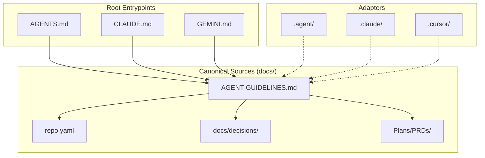

# mach-mono Documentation Hub

This directory is the flattened human-readable documentation hub for `mach-mono`. 

For machine-readable facts and policies, see [`../repo.yaml`](../repo.yaml). For centralized agent guidelines, see [`AGENT-GUIDELINES.md`](AGENT-GUIDELINES.md).

---

## 1. Documentation Index

The overall documentation structure is flattened into single-topic guides to prevent directory bloat:

| Concern | File | Description |
|---|---|---|
| **Repository Facts** | [`../repo.yaml`](../repo.yaml) | Structured machine-readable paths, targets, and policies. |
| **Agent Guidelines** | [`AGENT-GUIDELINES.md`](AGENT-GUIDELINES.md) | Central instruction set for AI coding agents. |
| **System Architecture** | [`Architecture.md`](Architecture.md) | Consolidates Overview, Plugin Architecture, Strict Modularization, and the frozen Sound Engine Spec. |
| **Guides & Runbooks** | [`Guide.md`](Guide.md) | Consolidates Getting Started, Plugin Development, CLI Tooling Map, iOS Sideloading, Release Runbook, and CI Docs. |
| **License Provenance** | [`Licensing.md`](Licensing.md) | Evidence ledger for the machNotch GPL-to-MIT migration. |
| **Roadmaps** | [`Roadmap.md`](Roadmap.md) | Consolidates the Product Roadmap and the Bazel Monorepo Roadmap. |
| **machBrief Implementation Plan** | [`../Plans/PLAN-machBrief.md`](../Plans/PLAN-machBrief.md) | Tracks machBrief macOS v1 implementation and iOS v2 sequencing. |
| **Decisions (ADRs)** | [`decisions/`](decisions/) | ADR-style architectural and system decision records. |

## 2. Documentation Flow

The following diagram maps how user entrypoint guides resolve to agent guidelines, adapters, decisions, and active plans:

---

## 3. Product Planning & Active Plans

- **Product Requirements (PRDs)**: Located at [`../Plans/PRDs/`](../Plans/PRDs/) to separate historical specifications from active documentation.
- **Active Plans & Spikes**: Located under the root [`../Plans/`](../Plans/) and the [`../tmp/spikes/`](../tmp/spikes/) directories.
- **UX Plan**: Swiped to [`../Plans/PLAN-uxShowcase.md`](../Plans/PLAN-uxShowcase.md) to track soundscape design.
- **HTML Audio Prototypes**: Moved to the local sandbox [`../tmp/fluid-symphony.html`](../tmp/fluid-symphony.html) and [`../tmp/fluid-symphony-v2.html`](../tmp/fluid-symphony-v2.html) for local A/B parity testing during native porting.

---

## 4. Maintenance Rules

1. Keep stable repo facts in `repo.yaml` instead of duplicating them.
2. Keep active product specs and status checklist rows inside PRDs.
3. Capture new long-term technical choices as ADRs in `docs/decisions/`.
4. Keep tool rules (`.cursor/`, `.claude/`, `.agent/`, root `CLAUDE.md`) as adapters referencing the canonical docs here.
